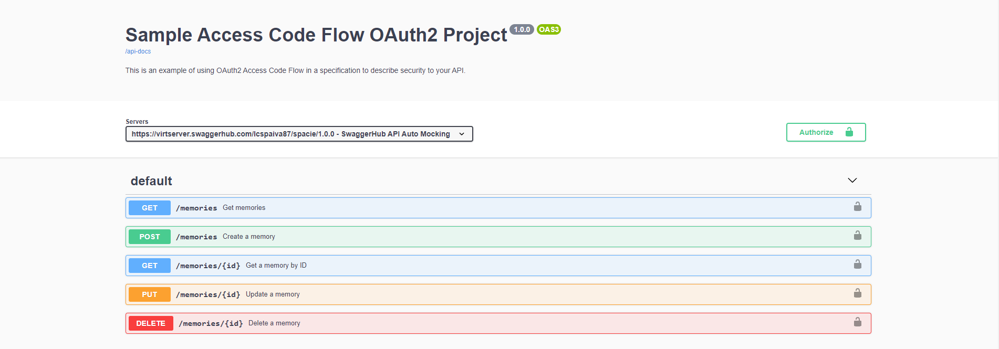

<p align="center">

</p>

<p align="center">


</p>


## :rocket: Tecnologias

#This project was developed using the following technologies:

<p align="center">

</p>

- [Firebase](https://firebase.google.com/?hl=pt)
- [NodeJs](https://nodejs.org/en)
- [TypeScript](https://www.typescriptlang.org/)
- [Prisma](https://www.prisma.io/)
## How to make it work on your machine

```sh
Execute this command to install all dependencies
$ git clone https://github.com/lcspaiva87/Spacetime-server.git && cd Spacetime-web
## api documentation
https://nodejs-server-server-generated.vercel.app/docs/

# Install the dependencies
yarn
##Link Api
https://github.com/lcspaiva87/Spacetime-server
# start the json-server api
yarn dev

# start project
yarn start

## 🤔 how to contribute
- Fork this repository;
- Create a branch with your feature: `git checkout -b my-feature`;
- Commit your changes: `git commit -m 'feat: My new feature'`;
- Push to your branch: `git push origin my-feature`.


After your pull request is merged, you can delete your branch.

---

Made with ♥ by Lucas Antonio
```


